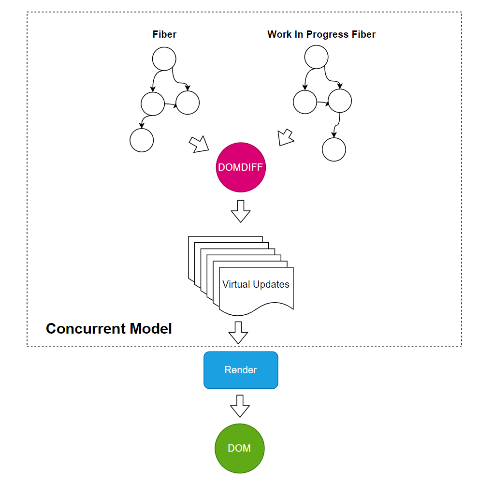

## React DOM Diff

### createElement

```tsx
function SomeComponent() {        
    return <div>
        <span>...</span>
        <Button>...</Button>
    </div>
}

React.createElement

class VirtualDomNode {
  type: “SomeComponent” 
  update() {
    const newVirtualDOM = this.type()
  }
}

ReactDOM.render(<SomeComponent />)
```

上面的jsx会被转换成树状结构

```
div
 span
 Button
```


### DOM Diff

任何一个组件使用setState方法时，React都会认为该组件变脏了，进而触发组件本身的重新渲染（re-render）。同时，因为React始终维护两套虚拟DOM，其中一套是更新后的虚拟DOM，另一套是前一个状态的虚拟DOM，所以可以通过对这两套虚拟DOM执行diff算法，找到需要变化的最小单元，然后把这个最小单元应用到真是DOM上。

通过diff算法找到这个最小单元集合后，React采取启发式思路进行一些假设，将两棵DOM树之间的差异寻找成本由O(n^3)缩减到O(n)。

具体比较策略如下：

- 对组件树进行分层比较，两棵树只会对同一层级的节点进行比较。
- 当对同一层级的节点进行比较时，对不同的组件类型，直接将整个组件替换为更新后的组件。
- 对同一层级节点进行比较时，对于相同类型组件，如果组件的state或props发生变化，则直接渲染组件本身。
- 对同一节点比较时，开发者可以利用key属性来声明同一层级节点的更新方式。

对于类型相同的节点，比如：

 ```tsx
function Button({text}) {
    return <button>{text}</button>
}
 ```

当发生变化的时候：

```tsx
<Button text="点我" />
// 到
<Button text="请按键" />
```

只需要替换属性即可，React遇到这种情况，会帮用户替换掉属性。


当遇到不同类型的节点，React会直接替换。

```tsx
<div>
  <Counter />
</div>

// 到
<span>
  <Counter />
</span>
```


对于子节点， React会进行对比和替换。

```tsx
<ul>
  <li>first</li>
  <li>second</li>
</ul>
// 到
<ul>
  <li>first</li>
  <li>second</li>
  <li>third</li>
</ul>
```

React会只insert第三个li。


但是对于下面这种乱序的情况，React会逐一替换：

```tsx
<ul>
  <li>Duke</li>
  <li>Villanova</li>
</ul>

<ul>
  <li>Connecticut</li>
  <li>Duke</li>
  <li>Villanova</li>
</ul>
```

这是因为DOM-DIFF会用简单的算法，顺序比较，而不是用动态规划。在比较一个列表的时候，用最短编辑距离（动态规划）后，仍然有昂贵的DOM操作（插入、删除）等。而动态规划算法的复杂度有O(n^2)。

为了解决比较慢的问题，React引入了key来解决：

```tsx
<ul>
  <li key="2015">Duke</li>
  <li key="2016">Villanova</li>
</ul>


//  到
<ul>
  <li key="2014">Connecticut</li>
  <li key="2015">Duke</li>
  <li key="2016">Villanova</li>
</ul>
```

上面程序中，React会用key来进行比较，上面程序会考虑到key相同的情况，认为key相同的是同一个节点。 因此2014会是一个插入的节点。


## Fiber

### DOM Element 和Fiber

我们先试图通过下面这个简单的例子来理解什么是Fiber

```tsx
<div>
   <Button><div>点我</div></Button>
   <p>点击按钮会带来惊喜！</p>
</div>
```


- ReactElement描述组件信息、组件的层级关系
- Fiber描述组件Diff等工作的调用关系
- DOM对应实际的渲染效果

下图描述的是当Button更新时的整体路径。 


### Fiber是什么

- Fiber是React Element数据的镜像
- Fiber是一份Diff工作
- Fiber模拟函数调用关系

### Fiber结构

```tsx
function FiberNode(...) {
  // 工作类型(Fiber类型) Component class | functional | 普通div更新，实际算法是有出入的
  this.tag = tag;
  
  // ReactElement.key
  this.key = key;
  

  // ReactElement.type， 自己定义的函数名（函数类型） | “div" "input"
  this.elementType = null;
    

  // Fiber
  // 执行完当前工作返回的Fiber 相当于Fiber的父节点
  this.return = null;
    
  // 当前Fiber的（最左侧）子Fiber  相当于Fiber的子节点
  this.child = null;
    
  // 当前Fiber的下一个同级Fiber
  this.sibling = null;
    
  ……
}
```

### Fiber的workInProgress


每个Fiber都有一个和自己对应的WorkInProgress。当发生变更时，原本的Fiber不变，而是构造一个WorkINProgress Fiber。当WorkInProgress构造好之后，原来的Fiber和WorkInProgress Fiber互相引用。 

`Work In Progress Fiber` 代表正在进行的工作。例如当一个组件的`state` 或者`props` 发生变更的时候，就会形成一个新的WorkProgressFiber。而DomDiff就发生在`Current Fiber` 和`Work In Progress Fiber` 间。

本质上，这是一种处理并发的技巧，叫做`Copy On Write` ——当有变更的时候，先复制原有的对象，修改完成后再替换原有的对象。

### Fiber更新的两个阶段

- 计算阶段（可中断）
  - 计算Work In Progress Fiber
  - 进行DOM DIFF，计算DOM的更新
- 提交阶段（不可中断）
  - 提交所有的更新


### Fiber的执行

驱动Fiber执行有很多种情况，主要的3中是：

- 根节点的render函数调用（例如： ReactDOM.render(\<App /\> ,) ）
- setState(useState)
- props变更，父节点属性发生变更，整个节点重绘

当上述情况发生时，`render` 库（如 ReactDOM)会触发Fiber的执行。

- 如果是新节点，那么创建Fiber
- 计算阶段：如果是变更，那么计算Work In Progress Fiber
- 计算阶段：render库执行，利用React 的DOM DIFF算法计算更新
- 提交阶段：应用更新


### Fiber并行

并行，就是任务可以交替的进行，看上去好像同时发生一样。如果要做到这一点，每个Fiber应该是独立的。

理论上计算阶段，一切都是虚拟的，父节点(Parent Fiber)和子节点(Child Fiber)可以是两个Work。

有同学可能会有疑问：

*从结构上，父节点`render` 函数调用子节点`render` 函数，那么子节点必须全部完成，父节点才能返回。这样就构成了依赖关系，不能并发执行。*

**那么，Fiber能不能先完成父Fiber再完成子Fiber呢？**

答案是：可以！

因为Fiber可以先计算出所有的Work In Progress，再DIFF。

- 计算Work In Progress需要按照递归顺序逐级进行
- 对Fiber和 Work In Progress Fiber之间的DIFF工作，可以并发进行
- 理论上：部分的Update工作，也可以并发进行

### 计算的分步进行

- createElement过程不可中断，需要一次执行完成

- Fiber和Work In Progress Fiber的构建过程需要一次递归做完

- DIFF工作可以并发，也就是可以：

  - 暂停（中断）/恢复执行
  - 异步（调度执行）


在上述工作中，DIFF的计算量最大，因此整体看Fiber的计算过程可以并行。暂停、恢复能力， 是并行能力的副产品。并行就意味着，任务可以调度执行。

在React Fiber的设计中，也引入了调度器来调度所有的计算任务。 

独立的任务非常适合并行，每个Fiber都是一个独立的任务。任务可以按照不同的顺序执行，最终的结果不发生变化，这就是Fiber提供最核心的能力。


### Reconciler

计算出来的更新如何应用到页面上？



在上面的模型中：

- 提供并行(Concurrent Mode)的核心是Fiber
- 提供渲染能力的是`Render` （例如ReactDOM.render)
- 提供DOM DIFF的模块叫做Reconciler

具体的：

```tsx
render = Reconciler(HostConfig)
```

HostConfig: 主机配置，具体是浏览器还是app等

当React进行真实渲染的时候，VirtualDOM的Diff算法会计算出更新步骤。但是当真正更新的时候，我们会遇到难题，就是如何支持多端渲染？ 

- DOM
- React Native
- Canvas
- ……

这个时候，需要一个调和器(Reconciler)将3部分个功能结合起来：

- VirtualDOM： 对组件层级结构的描述
- Reconciliation:  计算DOMDIFF
- HostConfig ：对于React渲染需要的具体端(DOM/React Native等)的封装
  - 删除元素的能力
  - 改变属性的能力
  - 插入元素的能力
  - 替换元素的能力
- ……

具体的，Reconciler允许我们自定义Render（例如写一个ReactDOM.render)

```tsx
const Reconciler = require('react-reconciler');

const HostConfig = {
  // You'll need to implement some methods here.
  // See below for more information and examples.
};

const MyRenderer = Reconciler(HostConfig);

const RendererPublicAPI = {
  render(element, container, callback) {
    // Call MyRenderer.updateContainer() to schedule changes on the roots.
    // See ReactDOM, React Native, or React ART for practical examples.
  }
};

module.exports = RendererPublicAPI;
```

更多资料可以参考：https://github.com/facebook/react/tree/main/packages/react-reconciler